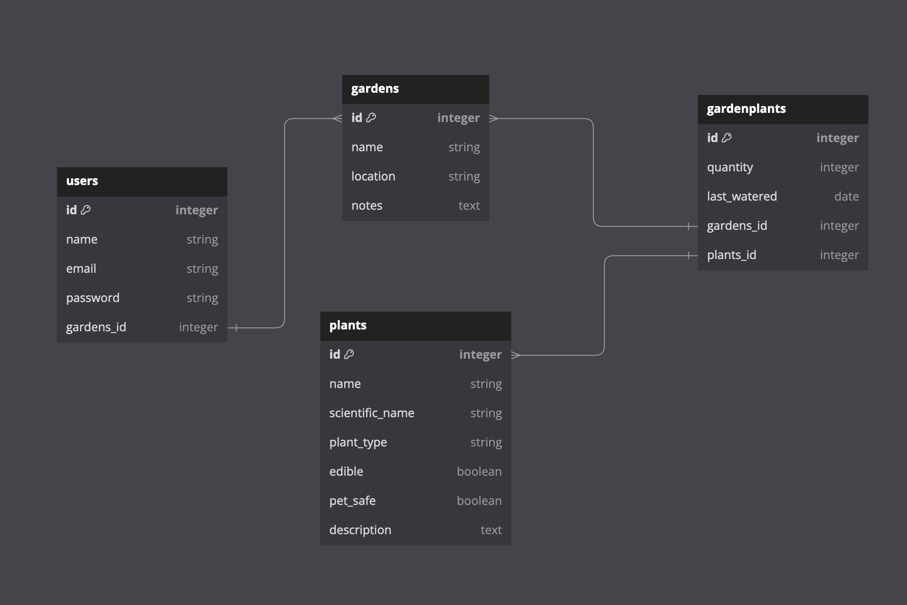

# Garden Guru App

## Overview

GardenGuru is a web application that allows users to manage their gardens, explore various plants, and perform actions such as planting, watering, and exploring new plants. The app provides a user-friendly interface with authentication features, plant management, and gardening capabilities.

## Table of Contents


- [Features](#features)
- [Database Diagram](#database-diagram)
- [Installation](#installation)
- [RSpec Tests](#rspec-tests)

## Features

### Authentication
- **Sign Up**: Users can create an account to start using the app.
- **Log In**: Users can log in with their credentials.
- **Log Out**: Users can log out of their account securely.

### Plants
- **View Plants**: Users can browse a list of available plants.
- **Sort Plants**: Users can sort plants based on attributes such as pet safety and edibility.
- **Add Plants**: Users can tell the app about new plants they would like available for their garden.
- **Water Plants**: Users can water their plants to keep them healthy and to track when they were last watered.

### Gardens
- **Create a Garden**: Users can create new gardens to organize their plants.
- **Add Plants to Garden**: Users can plant selected plants into their gardens.

## Database Diagram


## Getting Started

## Installation

### Setup

1. Clone the repository:
   ```
   git clone git@github.com:cmhorsey/my-plant-app.git
   cd my-plant-app
   cd my_plant_app
   ```
2. Install dependencies
   `bundle install`
3. Set up the database
    ```
    rails db:migrate
    rails db:seed
    ```
4. Start server
   `rails s`

## RSpec Tests

### Model Tests

 - `rspec ./spec/models/plant_spec.rb`
 - `rspec ./spec/models/garden_spec.rb`
 - `rspec ./spec/models/gardenplants_spec.rb`

### Feature/Integration Tests

- `rspec ./spec/features/plants_feature_spec.rb`
